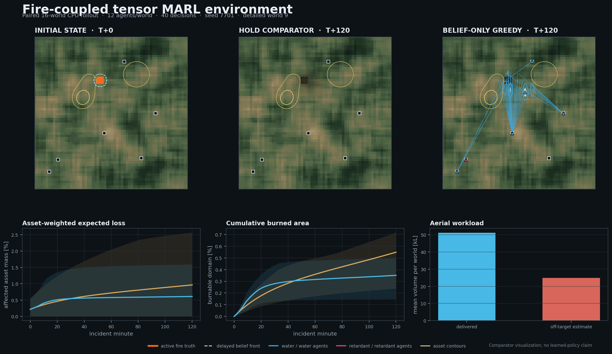

# wild-env

wild-env is a research environment for wildfire spread, suppression operations,
and multi-agent resource allocation. It combines a higher-fidelity incident
simulator with a fixed-shape PyTorch surrogate for large-batch reinforcement
learning.

The system includes heterogeneous aircraft and ground resources, airports and
water sites, payload and endurance constraints, delayed fire observations,
water and retardant delivery, fireline construction, historical incident
import, paired evaluation, and deterministic replay. The installed package is
`aeolus-ia`; the Python namespace remains `aeolus`.


*A recorded canonical-simulator episode in the native Qt viewer. The map,
vehicle table, event log, layers, camera, and timeline read the same immutable
replay bundle.*



*A reproducible 16-world CPU rollout from the tensor training environment. The
figure compares a hold action with the belief-only greedy baseline; it is a
mechanism check, not a learned-policy result.*

## Two simulation paths

| Path | Used for | Main tradeoff |
| --- | --- | --- |
| Canonical simulator | Fire-behavior studies, incident reconstruction, suppression evaluation, replay | More physical and operational detail; lower throughput |
| Tensor incident environment | Thousands of parallel MARL worlds, curriculum generation, policy iteration | Fixed-shape approximation that must be checked against the canonical simulator |

The canonical path uses spatial fuels and weather, wind/slope-coupled surface
fire, crown transition, spotting, dynamic moisture, and a WENO5/RK3 signed
level-set front. Suppression includes coverage-preserving drops, line
production and breach, service queues, finite stocks, dispatch gates, and
two-perimeter arrival-history initialization.

The tensor path keeps the decision state needed by the agents: hidden fire
truth, delayed belief, front tasks, treatment fields, vehicle motion, payload,
endurance, service contention, action masks, and constraint costs. Fire and
sortie transitions remain on the accelerator, and the policy uses recurrent
entity attention with centralized training and decentralized execution.

## Quick start

Python 3.10–3.12 is supported. Install the PyTorch wheel appropriate for the
target CUDA driver before installing the project on a cluster.

```bash
git clone https://github.com/amilcodes/wild-env.git
cd wild-env
python3 -m venv .venv
. .venv/bin/activate
python -m pip install --upgrade pip
python -m pip install -e '.[geo,viewer,dev]'
ruff check src tests tools
pytest
```

### Run and inspect a local incident

Record a deterministic reference episode, then open it in the desktop viewer:

```bash
aeolus-replay \
  --config configs/replay_reference.yaml \
  --policy nearest \
  --horizon-min 12 \
  --out runs/replays/reference

aeolus-view \
  --replay runs/replays/reference \
  --config configs/viewer/operational.yaml
```

Remove `--horizon-min 12` for the complete scenario horizon. The canonical
solver is intentionally much slower than the tensor environment; the full
reference case is an evaluation run rather than a laptop smoke test.

The viewer has synchronized 2D and terrain-3D views, time controls, camera
presets, selectable vehicles and events, layer controls, local GeoTIFF imagery,
still/video export, and ParaView export.

<details>
<summary>Terrain replay example</summary>


</details>

### Exercise the RL environment on a CPU

This small run validates mechanics and produces paired baseline measurements.
It is not a substitute for accelerator profiling or full training.

```bash
python tools/run_tensor_incident_study.py \
  --config configs/cluster_tensor_incident.yaml \
  --device cpu \
  --batch-size 32 \
  --steps 40 \
  --model-steps 8 \
  --out runs/tensor-study.json

python tools/render_tensor_incident_rollout.py
```

For a short end-to-end MAPPO check:

```bash
aeolus-train --config configs/smoke.yaml
aeolus-eval \
  --config configs/smoke.yaml \
  --checkpoint runs/smoke/checkpoint.pt \
  --episodes 32 \
  --out runs/evaluation.json
```

### Train at cluster scale

`configs/cluster_tensor_incident.yaml` is the main fire-coupled training
manifest. It targets 2,048 parallel worlds, 128-step rollouts, mixed precision,
compiled transitions and policy networks, recurrent MAPPO, and distributed
launch through Slurm.

```bash
AEOLUS_CONFIG=configs/cluster_tensor_incident.yaml \
  sbatch deploy/slurm/train.sbatch
```

Run the exact throughput harness on the target accelerator before sizing a
training campaign:

```bash
python tools/run_tensor_incident_study.py \
  --config configs/cluster_tensor_incident.yaml \
  --device cuda \
  --compile \
  --batch-size 2048 \
  --grid-size 64 \
  --segments 48 \
  --out results/tensor_incident/gpu-study.json
```

See [`docs/cluster.md`](docs/cluster.md) for container, DDP and Slurm details,
and [`docs/rl_training_execution_plan.md`](docs/rl_training_execution_plan.md)
for the training and transfer gates.

## Public incident data

The incident importer can assemble a timestamped bundle from NASA FEDS
perimeters, USGS 3DEP elevation, and LANDFIRE fuel and canopy products:

```bash
aeolus-incident import-feds \
  --region CONUS \
  --fire-id 61854 \
  --size 128 \
  --buffer-m 5000 \
  --split evaluation \
  --out runs/incidents/feds-61854

aeolus-incident validate runs/incidents/feds-61854
```

The resulting `IncidentBundle` retains source responses, timestamps, spatial
reference, transformations, checksums, and STAC metadata. GOFER hourly
satellite progression and locally normalized perimeter/weather products have
separate import paths described in
[`docs/data_contract.md`](docs/data_contract.md).

Historical runs distinguish hindcast, shadow replay, and counterfactual use:

```bash
aeolus-historical \
  --incident runs/incidents/feds-61854 \
  --mode hindcast \
  --policy no_aerial \
  --start-index 0 \
  --target-index 1 \
  --out runs/hindcast.json
```

The current six-fire held-out result remains close to persistence on cumulative
perimeter skill and weak on advancing-front localization. The larger
36-incident chronological partition is frozen at 22 training, seven
development, and seven test incidents to prevent calibration leakage. Current
results therefore support simulator and policy research; they do not establish
operational predictive skill. Exact protocols and retained artifacts are in
[`docs/historical_validation.md`](docs/historical_validation.md) and
[`docs/heldout_historical_skill_v6.md`](docs/heldout_historical_skill_v6.md).

## Release line

| Version | Main addition |
| --- | --- |
| 0.7 | Replay schema 2, native Qt/VTK inspection, deterministic 2D/3D/video export |
| 0.6 | Tensor operations and fire-coupled MARL environments, entity-attention MAPPO, service-site logistics |
| 0.5 | Volume-conserving suppression, line production and breach, two-perimeter coupled-state initialization |
| 0.4 | NIROPS held-out evaluation, uncertainty scoring, incident-level partitions and baselines |
| 0.3 | Timestamped public incident bundles, historical modes and scientific replay |
| 0.2 | Operational fire behavior, dynamic moisture, crown fire, spotting and level-set propagation |
| 0.1 | PettingZoo/RLlib environment, constrained task allocation and recurrent MAPPO baseline |

## Research boundaries

- The tensor environment is a calibrated decision surrogate, not a replacement
  for the canonical fire solver.
- Persistence remains a difficult historical spread baseline. Held-out skill,
  observation cadence, incident wind, spatial moisture, and unobserved
  suppression remain active accuracy constraints.
- Example aircraft and UAS capabilities are research assumptions until replaced
  by reviewed performance tables and site-specific operating data.
- Counterfactual suppression effects are simulator results, not estimates of
  real-world treatment effectiveness.

The full gap register and compute/non-compute closure plan are in
[`docs/limits_and_solutions.md`](docs/limits_and_solutions.md).

## Code and documentation map

| Area | Location |
| --- | --- |
| Fire, truth/belief and suppression mechanics | `src/aeolus/core` |
| Incident, fuel, weather and progression data | `src/aeolus/data` |
| PettingZoo, RLlib and tensor environments | `src/aeolus/envs` |
| MAPPO networks, rollout and distributed training | `src/aeolus/training` |
| Baselines, paired studies and historical evaluation | `src/aeolus/policies`, `src/aeolus/evaluation` |
| Replay recording, rendering and desktop inspection | `src/aeolus/replay`, `src/aeolus/viewer` |

Start with:

- [`docs/architecture.md`](docs/architecture.md) — state, information and execution boundaries.
- [`docs/fire_behavior.md`](docs/fire_behavior.md) — equations, numerical methods and validation limits.
- [`docs/tensor_incident_environment.md`](docs/tensor_incident_environment.md) — surrogate contract and measured throughput.
- [`docs/rl_compute_research.md`](docs/rl_compute_research.md) — policy and compute design.
- [`docs/viewer.md`](docs/viewer.md) — replay schema, controls and rendering.
- [`docs/scenario_configuration.md`](docs/scenario_configuration.md) — scenario and viewer YAML fields.

Repository provenance and artifact-retention policy are recorded in
[`docs/development_record.md`](docs/development_record.md) and
[`docs/repository_artifact_policy.md`](docs/repository_artifact_policy.md).

## License

Apache-2.0. Simulator and policy outputs are research artifacts and are not
certified for operational fire-management decisions.
