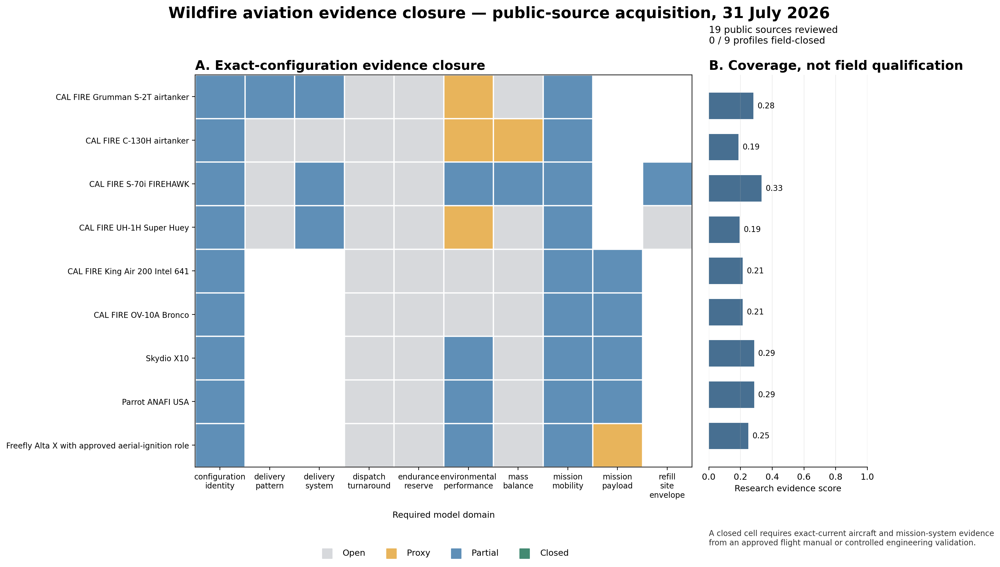

# Aviation evidence acquisition and simulator correction

## Result

The public-source search located enough configuration-specific material to
replace one important generic suppression model and to tighten several
operational assumptions. It did not locate enough exact-current flight data to
qualify any selected aircraft for dispatch or flight-safety use.

The principal implemented result is the CAL FIRE S-2T delivery model. The USDA
Forest Service conducted controlled cup-grid tests of the CDF Marsh-converted
S-2T with its 1,200-gallon constant-flow tank. The report gives flow rate,
controller setting, and longest measured line for coverage levels 0.5 through
10. Those tables now determine the S-2T footprint in the canonical simulator.

At coverage level 3 and a full 1,200-gallon load:

| Quantity | Previous generic configuration | Measured-table model |
|---|---:|---:|
| Line length | 650 m | 181.356 m |
| Width | 70 m | 20.491 m volume-equivalent width |
| Flow rate | not represented | 1,627.727 L/s |
| Controller setting | not represented | 3 |

The width is not claimed as a cup-grid measurement. The source reports contour
line length rather than a complete numerical deposition raster. The simulator
therefore computes a uniform-coverage-equivalent width from payload volume,
requested coverage, and measured line length. This transform is explicit in
the data record and conserves suppressant volume. The old and new bounding
areas differ by a factor of 12.24, showing why a generic rectangular footprint
was not acceptable.

The rectangular transform is restricted to coverage levels 0.5 through 6.
The report's level-8 and level-10 rows are retained as observations, but their
short *longest-contour* lengths would imply uniform-equivalent widths of about
65 m and 244 m. That inversion is an artifact of treating a contour statistic
as a complete footprint. Requests above level 6 are clipped to level 6 and
marked as extrapolated in the event log until the cup-grid deposition raster
or an approved delivery model is acquired.

The implementation chooses the requested coverage level from the target fuel
and modeled fire intensity, interpolates within the measured table, scales line
length with partial payload, and records the surface identifier, flow rate,
controller setting, footprint, requested coverage, and extrapolation status in
the event log.

The physical `retardant_coverage_gpc` field remains a cell-area average and is
used for volume accounting. A 20 m line is narrower than the reference
scenario's 60 m cell, so a second `retardant_effective_coverage_gpc` field
retains the tested target coverage on intersected treatment cells for spread
response. Both fields decay under the same retardant/rain model and are written
to replay output. This is a declared subcell topological closure: it avoids
diluting a narrow line to about 1.2 GPC solely because of grid size, but it does
not reconstruct the unavailable full cup-grid deposition raster.

## Sources acquired

Five public documents were downloaded from publisher-controlled locations and
checksum-verified:

| Document | Use | SHA-256 |
|---|---|---|
| [USFS S-2T drop guide](https://www.fs.usda.gov/t-d/pubs/pdfpubs/pdf06572848/pdf06572848dpi72.pdf) | Controlled S-2T delivery tests | `b876d555…f1be1` |
| [NWCG PMS 514](https://fs-prod-nwcg.s3.us-gov-west-1.amazonaws.com/s3fs-public/publication/pms514.pdf) | Current airtanker operations | `2c31a7d9…c6c01` |
| [PMS 514 Appendix E](https://fs-prod-nwcg.s3.us-gov-west-1.amazonaws.com/s3fs-public/publication/pms514-appendix-e-2026.pdf) | Current S-2 tactical procedures | `be340c97…9efb` |
| [USFS Aircraft Inspector Guide](https://www.fs.usda.gov/sites/default/files/2020-12/18-278212_aig_final_pre_policy_rev_6_28_2018_spf_letter_reduced.pdf) | UH-1 configuration/STC analysis | `32134d43…2458` |
| [Sikorsky FIREHAWK specification](https://www.lockheedmartin.com/content/dam/lockheed-martin/rms/documents/firehawk/9366_Firehawk_SellSheet_2025.pdf) | Tank, refill, speed, and role | `c8fcf08c…cfb8e` |

The acquisition tool downloads only documents with a declared cache path and
checks the complete digest. The cache is excluded from version control; the
registry, digests, extraction, and source URLs are versioned.

Fourteen additional government, operator, and manufacturer sources are in the
evidence registry. They cover CAL FIRE fleet identity, C-130H/MAFFS rules,
C-130H weight and fuel planning, S-70i operator calculations, the base UH-1H
manual, current UAS ordering, and the three selected small-UAS specifications.

## Configuration findings

### CAL FIRE S-2T

The current CAL FIRE page identifies the fleet as the Marsh conversion of
S-2E/G airframes, completed by 2005, with TPE331-14GR engines and a
1,200-gallon payload. The Forest Service test was published in 2006 for the CDF
Marsh S-2T constant-flow system. This is strong configuration-lineage evidence
and is suitable as an engineering reference for research simulation.

It is still marked `partial`, not `closed`, because public material does not
establish that every current tail retains the tested tank, gate controller,
software, calibration, weight state, and approved envelope. Current NWCG
standards state that S-2T procedures are governed by the CAL FIRE 8300 Aviation
Handbook and Fixed-Wing Flight Standards. Those documents were not available
through the public search. CAL FIRE's official records page directs focused
requests to its GovQA Public Records Center and permits anonymous requests when
a contact channel is supplied.

### CAL FIRE C-130H

The operator page identifies ex-USCG HC-130H airframes, T56-A-15 engines,
155,000-pound gross weight, and a 4,000-gallon retardant delivery system. Public
Air Force manuals provide valuable C-130H weight, fuel, high/hot, and
engine-out methodology.

The firefighting addendum is for the 3,000-gallon MAFFS installation. It states
that the external nozzle adds drag, that loaded high-density-altitude operation
can remove three-engine climb capability, and that crews must calculate from
the applicable C-130 performance manual. These constraints demonstrate what
the simulator must represent, but they do not apply to CAL FIRE's 4,000-gallon
RDS. No public CAL FIRE RDS flight-manual supplement, operating weight,
performance schedule, or cup-grid delivery table was found. The code does not
transfer MAFFS numbers into the RDS profile.

### CAL FIRE S-70i FIREHAWK

CAL FIRE publishes internal and external gross weights, 1,000-gallon tank
capacity, maximum cruise, approximate endurance, roles, and build-up company.
Sikorsky publishes a tank refill time below 45 seconds. The one-minute canonical
simulator now rounds that upper bound conservatively to one tick, rather than
using the prior two-minute vehicle assumption.

Sikorsky's iFly calculator accounts for installed options including the
FIREHAWK tank, hoist, open doors, searchlight, and sensors. That is the correct
path to payload/hover closure, but the underlying operator data are not public.
No public deposition grid for the 1,000-gallon belly tank was located.

### CAL FIRE UH-1H Super Huey

CAL FIRE identifies a highly modified UH-1H with a derated T53-L-703 engine.
The public Army operator's manual is for the T53-L-13 UH-1H/V. The Forest
Service Aircraft Inspector Guide documents multiple -703 STCs and explicitly
notes that the military charts do not account for that airframe/engine
combination. It also describes material changes in high/hot payload and
directional control from associated tail modifications.

The Army charts therefore remain a base-airframe proxy. They were not ingested
as CAL FIRE Super Huey performance. Exact STC applicability, composite/metal
blade state, tail-rotor configuration, tank installation, weight and balance,
and flight-manual supplement remain required.

### Sensor UAS and aerial ignition

The manufacturer data for Skydio X10, Parrot ANAFI USA, and Freefly Alta X are
useful for nominal endurance, speed, wind, ceiling, payload, and sensors.
Current interagency material establishes sensing, mapping, aerial ignition,
and staffed Type 1 support as operational UAS roles. It does not establish an
operational autonomous water-dropping swarm. Incident configuration, waiver,
communications, lost-link behavior, smoke performance, geolocation accuracy,
and battery-cycle logs remain open.

## Evidence contract

`configs/aviation/evidence_registry_v1.json` records 19 documents and every
required domain for all nine selected profiles. A domain is:

- `open` when no useful configuration evidence was located;
- `proxy` when evidence applies only to a base airframe, analogous system, or
  operating standard;
- `partial` when exact-current public specifications or controlled historical
  engineering data constrain the model but do not close it; or
- `closed` only when exact-current approved flight-manual or controlled
  engineering evidence covers the domain.

The loader rejects a `closed` claim unless its applicability is
`exact_current_configuration` and its evidence is graded `flight_manual` or
`engineering_validated`. The current audit contains 32 open, 5 proxy, 32
partial, and 0 closed domains. None of the nine vehicles is field-closed.



## Remaining acquisition package

The next external request should be configuration-specific rather than a broad
request for aircraft manuals.

For the S-2T, request the current CAL FIRE 8300 Aviation Handbook sections and
Fixed-Wing Flight Standards governing performance, loading, drop controller,
landing loaded, reserve, and environmental limits; current approved flight
manual/supplements; and confirmation that the 2006 tested Marsh tank/controller
configuration remains applicable to named tails.

For the C-130H, request the approved CAL FIRE RDS flight-manual supplement,
RDS operating weight and drag data, takeoff/landing and engine-out schedules,
delivery-system limitations, IAB or successor approval package, and controlled
drop-test tables.

For the S-70i, request authorized iFly exports or reviewed tables for the exact
CAL FIRE build across pressure altitude, temperature, gross weight, tank state,
crew/equipment state, hover IGE/OGE, cruise, reserve, and one-engine-inoperative
conditions; tank deposition tests; and dip-site geometry/approach constraints.

For the UH-1H, request the installed STC list and flight-manual supplements for
each modeled tail, including -703 engine, rotor blades, tail modifications, and
fixed tank; current weight-and-balance/equipment records; hover and payload
charts; and tank/bucket delivery tests.

The exact record descriptions, exclusions, preferred formats, and agency route
are in `docs/aviation_records_request.md`. A request may be anonymous, but CAL
FIRE requires a correspondence/release channel. No request was submitted from
this workspace.

## Reproduction

From the repository root:

```bash
PYTHONPATH=src .venv/bin/python tools/fetch_aviation_evidence.py
PYTHONPATH=src .venv/bin/python tools/run_aviation_evidence_closure.py
.venv/bin/python -m pytest -q tests/test_aerial_delivery.py tests/test_aviation_evidence.py
```

The audit outputs are
`results/aviation_evidence/aviation_evidence_closure.json` and
`results/aviation_evidence/aviation_evidence_closure.png`.
