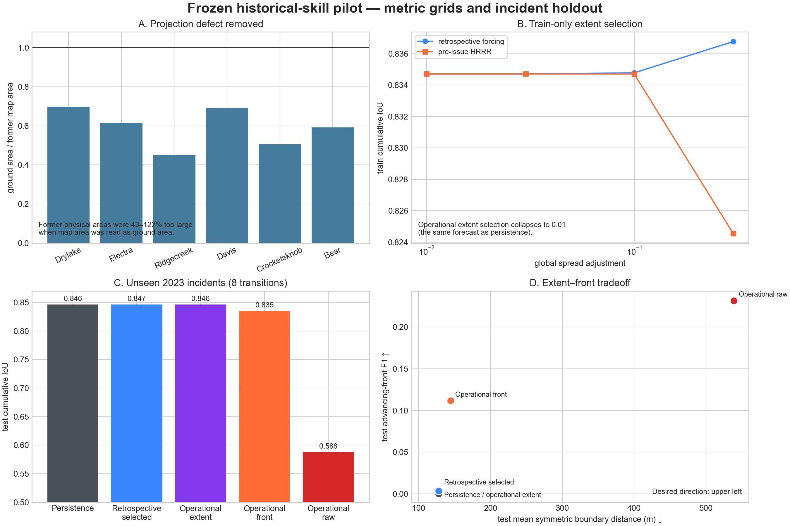

# Held-out historical skill: metric-grid, incident-frozen pilot

**Study date:** 2026-08-04  
**Status:** completed pilot; operational prediction gate not passed  
**Evaluation unit:** incident  
**Train/development/test incidents:** 2 / 2 / 2  
**Unseen test transitions:** 8 from two 2023 incidents



## Result in one paragraph

The current canonical fire model does not beat persistence on unseen incidents.
With archived HRRR forecasts that were available before each issue time, the
train-selected extent model chooses a spread adjustment of 0.01 and produces
exactly the persistence forecast on development and test. A separate
train-selected advancing-front model chooses 0.3. On the two unseen 2023
incidents it raises advancing-front F1 from 0 to 0.112, while cumulative IoU
falls from 0.8465 to 0.8353 and mean symmetric boundary error rises from 127.8
to 144.6 m. Unadjusted physics produces more front detections (F1 0.232) but
over-spreads severely: IoU 0.588 and boundary error 538.7 m. Physical detail
has therefore not yet translated into held-out predictive skill.

This is a pilot falsification result. Two test incidents are too few for a
general accuracy estimate, and the result does not isolate error due to fire
behavior from unobserved suppression, fuel vintage, wind downscaling, or
observation timing.

## What changed before this evaluation

### Physical coordinates

The original prepared landscapes were in EPSG:3857. Their nominal map metres
were used as ground metres for spread, cell area, boundary distance, aviation,
and treatment geometry. At the six incident latitudes, one square map metre
represented only 0.45 to 0.70 square ground metres. This made the previous
physical-distance and area interpretation invalid.

All six incident bundles were reprojected to local WGS84 UTM grids. Continuous
fields use bilinear interpolation, categorical fuel and barrier fields use
nearest-neighbor interpolation, and wind is reprojected as Cartesian vectors.
Perimeters now use cell-center inclusion rather than `all_touched` dilation.
Across all observations, the maximum raster-to-exact polygon area error is
2.73%; all six grids pass the projected-metre CRS gate.

The public landscape importer now performs the same conversion during bundle
construction. Its Web Mercator service request is treated as an acquisition
grid only, with a latitude-corrected ground-distance buffer; the simulator and
retained combined GeoTIFF are local UTM products.

### Frozen incident partition

The compact pilot contract is
[`configs/historical_validation_frozen_pilot.yaml`](../configs/historical_validation_frozen_pilot.yaml).
It references the base manifest by SHA-256 and assigns whole incidents:

| Split | Incidents | Use |
|---|---|---|
| Train | Dry Lake (2020), Bear (2021) | select global parameters only |
| Development | Electra, Crockets Knob (2022) | diagnostic evaluation |
| Test | Ridge Creek, Davis (2023) | final untouched pilot evaluation |

Incident-specific candidate values in the older manifest are ignored outside
train. Test target perimeters are prohibited during fitting, method selection,
and forcing construction. A separate frozen 36-incident chronological contract
is present, with 22 train, 7 development, and 7 test incidents, but its full
metric/time-admissible corpus has not yet been materialized and run.

### Causal coupled-state initialization

Every physics forecast begins at perimeter index at least one. The previous and
current perimeter reconstruct a harmonic arrival-time field, fire age, fuel
remaining, level set, and recently active front. The target perimeter is not
read. This follows the fire-history replay structure evaluated in WRF-SFIRE
perimeter-assimilation work, where gradual initialization from a reconstructed
arrival history produced the most consistent coupled fire/atmosphere state.

The present Aeolus run is not a coupled atmosphere calculation: history is
used to initialize the fire and fuel state, while the atmospheric forecast is
prescribed. No plume or fire-induced wind claim follows from this test.

### Operationally available atmospheric forcing

The retrospective run uses verifying HRRR analysis where available and NASA
POWER/MERRA-derived reanalysis elsewhere. That run is retained as an
analysis-forced sensitivity, not an operational forecast.

For the operational-input run, 24 transition-specific forcing files were
materialized from the public HRRR Zarr archive:

- one archived forecast cycle per transition;
- an assumed two-hour publication/availability lag;
- F01--F48 only, with the selected reference time no later than issue time
  minus the declared lag;
- native approximately 3 km, 10 m vector wind, 2 m temperature and relative
  humidity, and surface precipitation rate sampled to scenario cell centers;
- absolute forecast-reference, issue, target, and lead times in each NetCDF;
  and
- a SHA-256 digest and availability audit for every transition.

Dead-fuel moisture is initialized from the last background state at or before
the first forecast valid time, then advanced only with fields from the selected
forecast cycle. A regression test prevents interpolation across the issue
boundary: an earlier implementation incorrectly allowed a future background
sample to enter an issue-time live-moisture interpolation. Live fuel moisture
is held at its issue-time state during the forecast. Five incident backgrounds
lack live-fuel trajectories, so those windows use the declared model defaults
of 0.75 kg/kg herbaceous and 0.60 kg/kg woody moisture. That fallback remains a
material realism limit.

## Predeclared models and metrics

All physics methods use WENO5/RK3 front propagation, FBFM40 surface behavior,
crown transition, no spotting, no suppression actions, and two-perimeter
arrival history.

| Method | Parameter source | Interpretation |
|---|---|---|
| Persistence | none | current cumulative perimeter remains fixed |
| Raw physics | fixed at 1.0 | unadjusted fast-model rate of spread |
| Global extent | train incidents only | maximizes incident-weighted cumulative IoU |
| Global front | train incidents only | maximizes incident-weighted one-cell-tolerance advancing-front F1 |

The candidate adjustments in this laptop pilot are 0.01, 0.03, 0.1, and 0.3.
The cluster contract retains a wider 0.01--3.0 range. Extent and advancing-front
selection are separate because daily cumulative-perimeter overlap strongly
rewards near-zero spread.

Reported metrics are cumulative IoU, symmetric-difference area, mean symmetric
boundary distance, and one-cell-tolerance F1 on newly observed growth. Means
are computed within incident and then averaged across incidents so an incident
with more transitions cannot dominate the result.

## Results

### Train selection

| Forcing | Extent-selected adjustment | Front-selected adjustment |
|---|---:|---:|
| Retrospective analysis/reanalysis | 0.3 | 0.3 |
| Pre-issue archived HRRR forecast | 0.01 | 0.3 |

Under operational forcing, adjustments 0.01, 0.03, and 0.1 all produce no
detected train growth at the raster scale. Adjustment 0.3 yields train front F1
0.114 but lowers train cumulative IoU from 0.8347 to 0.8246.

### Unseen test incidents

| Forcing/method | IoU ↑ | Symmetric difference (km²) ↓ | Boundary error (m) ↓ | Front F1 ↑ |
|---|---:|---:|---:|---:|
| Persistence | **0.8465** | **2.840** | **127.8** | 0.000 |
| Retrospective, selected 0.3 | 0.8465 | 2.840 | 127.8 | 0.004 |
| Operational, extent 0.01 | **0.8465** | **2.840** | **127.8** | 0.000 |
| Operational, front 0.3 | 0.8353 | 3.151 | 144.6 | 0.112 |
| Operational, raw 1.0 | 0.5881 | 13.633 | 538.7 | **0.232** |

The retrospective selected result differs from persistence by only +0.000024
IoU, with an incident-cluster interval spanning zero. No physics method passes
the predeclared positive incident-cluster improvement gate. With only two test
clusters, interval estimates are descriptive and should not be treated as
stable inferential uncertainty.

### Incident-level behavior

| Operational method | Ridge Creek IoU / area bias | Davis IoU / area bias |
|---|---:|---:|
| Persistence | 0.931 / -0.82 km² | 0.762 / -4.86 km² |
| Front-selected 0.3 | 0.928 / -0.71 km² | 0.742 / -3.77 km² |
| Raw 1.0 | 0.675 / +5.69 km² | 0.501 / +15.99 km² |

The 0.3 model modestly fills missing area on both incidents. On Davis, that
additional growth is poorly localized and increases mean boundary error by
34.2 m. Raw physics changes the error sign and overgrows both incidents. The
problem is therefore more specific than an overall rate deficit: rate,
direction, active-flank localization, and unobserved containment are not
jointly correct.

## Interpretation

1. **Daily cumulative IoU is an insufficient selection objective.** Consecutive
   NIROPS perimeters overlap heavily, so persistence has high IoU while making
   no advancing-front prediction. The separate front objective exposes this
   degeneracy, but optimizing front F1 alone accepts unacceptable false growth.

2. **One global spread scalar is underfit physically and overfit statistically.**
   It absorbs errors in wind exposure, moisture, fuel vintage, suppression,
   crown transition, spotting, and observation timing. A larger training set
   can support a hierarchical correction model with uncertainty; the two-train-
   incident pilot cannot.

3. **Forecast forcing is necessary but not sufficient.** Replacing verifying
   fields with archived pre-issue HRRR forecasts makes the evaluation causal.
   It also changes the fitted multiplier and worsens raw overgrowth. This is a
   sensitivity result, not a comparison of HRRR forecast and analysis quality,
   because other components remain confounded.

4. **Front movement exists in the simulator.** Raw and 0.3 models localize some
   observed growth. Their false-positive extent is much larger than the gain.
   The next work should target spatial correction and observation/suppression
   confounding rather than increasing physical complexity without validation.

## Remaining validity limits and closure order

### P0: run the frozen expanded benchmark

Materialize all 36 selected incidents on metric grids with time-admissible fuel
products and transition-specific operational HRRR forecasts. Keep the frozen
2020--21 train, 2022 development, and 2023--24 test split. Require at least 12
test incident clusters before using a cluster interval as a decision gate.

This is partly compute-bound. Data acquisition and audits run on a workstation;
the full WENO candidate/ensemble matrix belongs on the cluster.

### P0: improve observation targets

Use higher-cadence progression products where available. GOFER supplies hourly
perimeters, active fire lines, and spread rates for 28 California fires and was
evaluated against FEDS and final FRAP perimeters. It can reduce daily-cadence
aliasing and make advancing-front timing measurable. NIROPS remains valuable as
an independent airborne-IR reference. Observation footprints, cloud, parallax,
acquisition windows, and analyst interpretation uncertainty must enter the
score or likelihood rather than being treated as exact raster truth.

This is principally data/model work, not heavy compute.

### P0: represent unobserved suppression as a confound

The no-action historical forecast is compared with fires that were actively
managed. Do not infer a physical spread correction from target perimeters
without an incident operations record. Near term, stratify by detectable
containment/line evidence and evaluate an interval or latent suppression
effect. Long term, ingest time-indexed resource and line data where available
and evaluate both no-action spread and action-conditioned replay.

This is data-limited. More simulation does not identify missing actions.

### P1: incident wind and moisture state

Fuse pre-issue RAWS observations with archived HRRR forecasts, use a terrain-
aware wind correction with held-out station validation, and carry spatial
dead/live moisture uncertainty into an ensemble. Live-fuel defaults in five of
six pilot incidents must be removed. Any coupled-atmosphere or learned wind
correction should be trained only on train incidents or independent teacher
cases.

The station fusion and validation are workstation-scale. Coupled WRF-SFIRE or
QUIC-Fire teacher ensembles are compute-bound.

### P1: replace scalar adjustment with a train-only correction hierarchy

Fit bounded corrections by fuel family, wind exposure, slope class, moisture,
and fire regime, with partial pooling by incident and uncertainty that expands
out of distribution. Select the model family on development incidents and run
the test split once. Report persistence, geometric spread, raw physics, and the
correction hierarchy together.

The statistical fit is moderate. Producing enough canonical and coupled-model
training trajectories is compute-bound.

## Reproduction

```bash
# Repair legacy physical grids.
python tools/reproject_historical_corpus.py \
  ../outputs/historical-validation-v5-time-admissible \
  ../outputs/historical-validation-v6-metric

# Globally fitted geometric baselines.
python tools/run_frozen_historical_benchmark.py \
  configs/historical_validation_frozen_pilot.yaml \
  ../outputs/historical-validation-v6-metric \
  results/frontier_fire/historical_validation_v6_metric_frozen/baseline_results.json

# Retrospective canonical-physics sensitivity.
python tools/run_frozen_physics_benchmark.py \
  configs/historical_validation_frozen_pilot.yaml \
  ../outputs/historical-validation-v6-metric \
  results/frontier_fire/historical_validation_v6_metric_frozen/physics_results.json \
  --workers 8

# Pre-issue HRRR transition corpus.
python tools/materialize_operational_hrrr_forcing.py \
  configs/historical_validation_frozen_pilot.yaml \
  ../outputs/historical-validation-v6-metric \
  ../outputs/historical-validation-v6-operational-hrrr

# Operational-input canonical physics.
python tools/run_frozen_physics_benchmark.py \
  configs/historical_validation_frozen_pilot.yaml \
  ../outputs/historical-validation-v6-metric \
  results/frontier_fire/historical_validation_v6_metric_frozen/physics_operational_hrrr_results.json \
  --workers 8 \
  --operational-forcing-root ../outputs/historical-validation-v6-operational-hrrr
```

The physics runner uses atomic per-hindcast checkpoints. Cache keys include the
schema version, transition, model setting, initialization mode, and exact
forcing-file digest.

## External basis

- Kochanski et al., *Analysis of methods for assimilating fire perimeters into
  a coupled fire-atmosphere model*, Frontiers in Forests and Global Change,
  2023. <https://doi.org/10.3389/ffgc.2023.1203578>
- Liu et al., *Systematically tracking the hourly progression of large
  wildfires using GOES satellite observations*, Earth System Science Data,
  2024. <https://doi.org/10.5194/essd-16-1395-2024>
- University of Utah MesoWest, *Accessing and Reading the HRRR Zarr Archive*.
  <https://mesowest.utah.edu/html/hrrr/zarr_documentation/html/zarr_HowToDownload.html>
- NOAA Open Data Dissemination, *High-Resolution Rapid Refresh Model archive*.
  <https://registry.opendata.aws/noaa-hrrr-pds/>
- LANDFIRE, *Historical Disturbance* and *Disturbance and Treatment Polygons*.
  <https://landfire.gov/disturbance/hdist> and
  <https://landfire.gov/reference/publicevents>

## Artifacts

- Metric-grid audit: `../outputs/historical-validation-v6-metric/metric_reprojection_manifest.json`
- Operational forcing audit: `../outputs/historical-validation-v6-operational-hrrr/operational_forcing_manifest.json`
- Geometric baselines: `results/frontier_fire/historical_validation_v6_metric_frozen/baseline_results.json`
- Retrospective physics: `results/frontier_fire/historical_validation_v6_metric_frozen/physics_results.json`
- Operational physics: `results/frontier_fire/historical_validation_v6_metric_frozen/physics_operational_hrrr_results.json`
- Digest-locked claim manifest: `results/frontier_fire/historical_validation_v6_metric_frozen/study_manifest.json`
