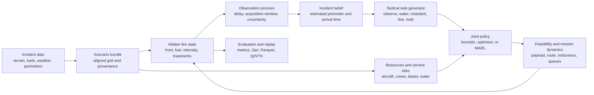

# Aeolus-IA: a technical guide to the complete research system

## Summary

Aeolus-IA is a research environment for studying how a group of aircraft and
ground resources could coordinate during a wildfire. It combines five kinds of
work that are often separated:

1. a spatial fire-spread model;
2. a model of incomplete and delayed knowledge about the fire;
3. water, retardant, fireline, aircraft, base, and service logistics;
4. multi-agent decision policies and reinforcement learning; and
5. historical evaluation and deterministic replay.

The project can import real terrain, fuels, weather, and timestamped fire
perimeters. It can initialize a simulated fire from an observed perimeter,
advance it under changing conditions, assign resources to tactical tasks, and
compare the resulting perimeter with a later observation. It can also generate
large batches of logistics problems for GPU-based policy training and record an
episode for inspection in a native desktop viewer.

This is a research simulator. Current results support mechanism studies,
historical sensitivity analysis, algorithm comparison, and visualization. They
do not support live incident prediction, autonomous dispatch, aircraft flight
planning, or a field claim that a learned policy improves firefighting.

## The system in one diagram



The arrows form a closed loop. A policy never assigns resources to a static
picture. Fire growth changes the belief, the belief changes the tasks, resource
missions change suppression state, and suppression changes subsequent growth.

## 1. Incident data

### The incident bundle

Each real incident is stored as a relocatable directory with a STAC 1.1 Item.
The item identifies four main assets:

- a GeoTIFF containing terrain, fuel-model, and canopy bands;
- a compressed simulator landscape with aligned numerical arrays;
- timestamped GeoJSON perimeter observations; and
- CF-NetCDF weather forcing.

The arrays share one coordinate system, affine transform, cell size, width, and
height. The loader rejects missing files, paths outside the incident directory,
unsupported schema versions, inconsistent shapes, and invalid units.

The simulator landscape includes:

- elevation;
- Scott/Burgan FBFM40 surface-fuel model;
- surface-fuel load;
- canopy cover, height, base height, and bulk density;
- barriers or non-burnable cells; and
- a spatial objective-value field.

The metadata records the original service, edition, time cutoff,
transformations, split, and checksums. This matters because a numerical array
without source and date information is weak historical evidence.

### Weather and fuel moisture

Weather may be incident-wide or a full field over time and space. The forcing
contract contains wind speed and direction, temperature, humidity,
precipitation, dead-fuel moisture, live herbaceous moisture, and live woody
moisture.

The historical preparation path uses NASA POWER as a long spin-up background
and NOAA HRRR analysis during the incident. Terrain downscaling adjusts
temperature by elevation and recomputes relative humidity while conserving
water-vapor pressure. Dead fuels follow prognostic time-lag equations. Live
fuel moisture follows a growing-season calculation with dynamic herbaceous
curing.

This forcing is more complete than a constant wind vector. It still lacks a
validated incident-scale terrain-flow correction. The next forcing study needs
held-out RAWS stations, fuel-stick observations, spatial live-fuel products,
and correction covariance.

### Historical fuel reconstruction

The first six historical bundles used LANDFIRE 2025 for fires observed between
2020 and 2023. That product can contain post-incident disturbance information.
Every previous bundle therefore failed the historical fuel gate.

The replacement process selects a LANDFIRE state whose included disturbances
end before the incident. It downloads FBFM40 and four canopy layers, aligns
them exactly to the existing terrain grid, stores each raw raster, computes
checksums, rebuilds the simulator arrays, and reruns the provenance audit.

All six replacement bundles pass the national-version cutoff gate. They use
LANDFIRE 2016 Remap, whose disturbance inputs end in 2016 and whose capable
fuel state is effective for 2019. A closer archived version remains desirable
for five incidents: LF2019L for the 2021 Bear fire and LF2020 for the four 2022
or 2023 fires.

This replacement changed 62–91% of FBFM40 cells across the incidents. The mean
change was 76.34%. The mean change in burnable versus non-burnable
classification was 6.02%. Those values show why fuel vintage belongs in the
validity gate.

## 2. Fire state and propagation

### State variables

The hidden fire state is a set of aligned grids. Important fields include:

- a signed level-set field for the fire front;
- unburned, active, and burned phase;
- arrival time and burn age;
- remaining fuel;
- spread rate and direction;
- fireline intensity and flame length;
- surface, passive-crown, or active-crown fire type;
- effective water and retardant coverage; and
- constructed-line status.

The front is the zero contour of the level-set field, usually written as
`phi(x, y, t) = 0`. Propagation follows the Hamilton–Jacobi form

`d phi / d t + R |grad phi| = 0`,

where `R` is the local directional spread rate.

### Local fire behavior

Local surface behavior comes from a packaged table generated with Pyretechnics
for Anderson and Scott/Burgan fuel models. The lookup varies with:

- FBFM40 code;
- 1-hour dead-fuel moisture;
- live herbaceous and live woody moisture;
- 10-m wind speed; and
- terrain slope.

Wind and slope effects are combined as vectors. The result supplies head-fire
direction, head and backing rates, ellipse eccentricity, intensity, and flame
length. Crown initiation uses canopy structure and a Van Wagner-style critical
intensity. Active crown spread uses a Cruz-style relation. Statistical embers
can be lofted downwind, survive transport, and ignite a secondary fire.

The primary numerical front uses fifth-order weighted essentially
non-oscillatory spatial derivatives and third-order strong-stability-preserving
Runge–Kutta time integration, commonly shortened to WENO5/RK3. A Godunov
level-set solver and an older adaptive Huygens raster solver remain available
for numerical comparisons and inexpensive screening.

Crown and spotting mechanisms are implemented, but their empirical
transitions have not been independently calibrated on held-out incidents.
Results entering those regimes are marked as mechanism-only.

## 3. Observations, belief, and initialization

Historical perimeters are measurements of cumulative burned extent. They do
not reveal the exact active front, acquisition time, suppression history, or
local spread velocity.

Aeolus keeps hidden truth separate from the policy's incident belief. An
observation can have:

- acquisition start and end;
- availability time;
- detection and false-alarm probability;
- smoke or cloud obscuration; and
- spatial localization error.

When exact scan time is unavailable, the likelihood integrates over an
acquisition window. This avoids treating the end of a several-hour collection
period as the exact time at which every mapped cell burned.

The coupled-state initializer can use two observed perimeters. It reconstructs
an approximate arrival-time history between them, then derives burn age, fuel
memory, heat memory, and recent front velocity. The velocity correction is
localized to a band around the advancing front and decays away from it. This
addresses an important perimeter-assimilation problem: copying the latest
shape into the model without reconstructing internal state produces an
inconsistent starting condition.

The actor sees belief-derived features and public resource state. It does not
receive hidden phase, true intensity, or unobserved fire growth. The
centralized critic may receive privileged features during training. Tests
mutate hidden truth while holding belief fixed and verify that actor
observations do not change.

## 4. Suppression and field operations

### Water and retardant

Water and retardant are stored as conserved liquid volume per ground area. One
coverage level corresponds to one U.S. gallon per 100 square feet. A drop
produces a spatial footprint determined by available volume, requested line
geometry, wind drift, and dispersion.

Water decays quickly. Long-term retardant persists longer and can be washed by
rain. Effective treatment reduces intensity or spread rather than turning a
cell into an unconditional barrier.

### Ground line

Crews and dozers construct line over several minutes. Production has explicit
width, rate, variability, and intensity limits. A line can be unengaged,
holding, or breached. Holding is local to the treated segment; an open flank
can still permit the fire to go around it.

### Logistics

Resources have positions, payload, dispatch delay, endurance, reserve,
assignment, target, and mission phase. Service sites include:

- airports;
- helibases;
- retardant bases;
- dip sites;
- scoopable water bodies; and
- temporary tanks.

Sites have compatible services, bays, approach capacity, turnaround time,
refill rate, finite stock, water depth, and minimum usable length. Resources
travel, queue, refill, recover endurance, and return to the incident. Competing
resources therefore interact through task capacity, shared airspace, and base
queues.

The current model has no taxi sequencing, maintenance process, crew-duty
clock, retardant mixing batches, detailed lake bathymetry, or complete incident
airspace-control workflow.

## 5. Aviation representation

### What current agencies use

NIFC reports a federal wildfire fleet of roughly 200–300 aircraft, almost all
privately contracted. It includes large and very large airtankers, SEATs,
water scoopers, helicopters, aerial supervision, mapping, transports, and
smokejumper aircraft.

The selected named crewed profiles come from CAL FIRE because its current
public fleet pages provide a coherent operator-specific list and nominal
specifications:

- Grumman S-2T airtanker;
- C-130H airtanker;
- S-70i FIREHAWK;
- UH-1H Super Huey;
- OV-10A air-tactical aircraft; and
- King Air 200 intelligence aircraft.

Current interagency UAS ordering covers situational awareness, infrared
mapping, small-area mapping, aerial ignition, and contracted Type 1 large-fire
support. The catalog includes Skydio X10, Parrot ANAFI USA, and Freefly Alta X
reference profiles. Operational UAS missions include pilots, managers,
dispatch, and incident-airspace coordination. The project found no government
evidence for an operational autonomous water-dropping swarm. Coordinated
uncrewed suppressant delivery remains a research objective in this simulator.

### Evidence-grading

The machine-readable catalog stores every parameter as:

- directly published;
- a unit conversion;
- a mapping from operational role into simulator state; or
- a modeling assumption.

The current catalog has nine traceable profiles and zero field-performance-ready
profiles. A 19-source configuration registry records open, proxy, partial, and
closed evidence separately for mobility, mass, environmental performance,
mission systems, delivery, refill, endurance, and turnaround. The public audit
currently has no closed domains because exact-current approved data remain
absent.

One subsystem is materially stronger. USDA Forest Service controlled cup-grid
tests of the CDF/CAL FIRE Marsh S-2T now drive the retardant line model. At
coverage level 3, a full load produces the table's 181.356 m longest line; the
simulator derives a 20.491 m volume-equivalent width and records its controller
setting and flow rate. This replaces the generic 650 by 70 m footprint. It is
still a research reference because current tail-level tank/controller
continuity has not been confirmed.

A vehicle can only receive a `flight_manual` or `engineering_validated` grade
when a reviewed performance surface is attached. The catalog loader enforces
that rule.

### Flight and route constraints

The canonical simulator evaluates:

- density altitude;
- payload-dependent speed and endurance when a performance surface exists;
- headwind, tailwind, and crosswind;
- terrain clearance and maximum altitude;
- time-active airspace volumes;
- service-site geometry;
- mission endurance and reserve; and
- payload availability.

The route is currently a straight tactical leg. Route repair, obstacle
databases, separation assurance, drop-lane occupancy, lead-plane and ATGS
authorization, lost-link behavior, alternates, and emergency procedures remain
outside the model.

## 6. Multi-agent decisions and reinforcement learning

### Decision problem

The environment is a cooperative, partially observed, semi-Markov decision
process. Fire and mission state advance each simulated minute. Policies act
every few minutes.

The task generator extracts candidate work from the current belief:

- observe an uncertain area;
- place water;
- build a retardant line;
- reinforce a line;
- construct crew or dozer line; or
- hold.

Tasks have a location, orientation, compatible resource types, expected value,
uncertainty, capacity, and ground dependency. Each resource receives task
features, its own state, selected fleet summaries, and a hard action mask.

If independent actors choose the same limited-capacity task, a seeded auction
resolves the conflict. The exact joint-assignment comparator solves the finite
resource/task matching problem over the same task graph. It is an important
baseline because a learned policy should add value beyond valid matching.

### Policy models

The included learning models are recurrent MAPPO variants:

- a masked task-pointer actor;
- an entity-attention actor for heterogeneous fleets;
- one GRU state per resource;
- a centralized training-only value function;
- clipped policy and value updates;
- generalized advantage estimation;
- entropy regularization and gradient clipping;
- automatic mixed precision; and
- checkpointed model, optimizer, configuration, and random state.

The trainer also supports a behavior-cloning warm start from an explicit
comparator before on-policy updates. This produces a measurable pretraining
stage rather than an unexplained initialization.

No trained checkpoint currently establishes superiority over doctrine,
optimization, heuristics, and no-action baselines on frozen historical or
high-fidelity test sets. Policy research should report at least five training
seeds and paired evaluation over frozen incident, geography, and weather
splits.

## 7. Computing and cluster design

Python coordinates experiments, data contracts, policy code, and reference
simulation. PyTorch provides accelerator-resident tensors, automatic
differentiation, compilation, and distributed training. This is a common
division for scientific machine learning: orchestration remains in Python,
while heavy array operations execute in compiled CPU or GPU kernels.

Two simulation paths exist:

- the canonical NumPy environment, which contains the complete coupled
  fire-belief-operations semantics; and
- the batched PyTorch operations environment, which keeps resource, site,
  queue, task-mask, reward, rollout, model, and optimization state on the GPU.

`TensorFireKernel` provides batched fire behavior and WENO front propagation.
The important remaining systems task is to join tensor fire, delayed belief,
front extraction, task generation, and tensor operations into one
accelerator-resident transition.

Cluster training uses one process per GPU, DistributedDataParallel, NCCL,
mixed precision, preemption-aware checkpoints, and Slurm/Apptainer launch
contracts. C++/CUDA or Triton is reserved for measured bottlenecks such as
front stencils, spotting, treatment footprints, distance transforms, and
active-front extraction.

The primary historical WENO5 study is CPU-parallel. A two-element Slurm array
runs the old and replacement fuel corpora on separate 32-core allocations.

## 8. Evaluation

### Historical protocol

The six-fire benchmark contains 24 held-out perimeter transitions. One earlier
interval per incident supplies a low-dimensional calibration. Later intervals
are scored without using their target perimeter during initialization or
parameter selection.

Reported metrics include:

- cumulative perimeter intersection-over-union;
- symmetric-difference area;
- mean and 95th-percentile boundary displacement;
- newly burned or advancing-front overlap;
- one-cell-tolerance front F1;
- arrival-time error;
- Brier and balanced Brier scores; and
- reliability.

Persistence is a serious baseline: it predicts that the latest observed
perimeter remains unchanged. It often scores well on cumulative extent when
the observation interval contains little mapped growth. Advancing-front and
probabilistic metrics are included to expose that behavior.

Historical perimeter growth also contains suppression that is absent from the
data. The benchmark therefore measures agreement with the observed incident,
not pure unsuppressed physics.

### Fuel-vintage result from this effort

The fixed-parameter screening study contains 96 simulations: two fuel vintages,
two fixed coefficient branches, six incidents, and four held-out transitions.
Weather, observations, elevation, initialization, code, coefficients, and
seeds remain fixed within each pair.

Under raw coefficients:

- mean perimeter IoU increases from 0.325 to 0.390;
- mean boundary distance decreases from 1,913 m to 1,507 m; and
- one-cell advancing-front F1 increases from 0.120 to 0.144.

Under frozen reference spread coefficients:

- mean perimeter IoU increases from 0.221 to 0.281;
- mean boundary distance decreases from 2,737 m to 2,230 m; and
- one-cell advancing-front F1 increases from 0.072 to 0.095.

The screening solver is the legacy adaptive Huygens implementation. The
result demonstrates material and generally favorable sensitivity to the
historical fuel repair. Absolute errors remain large. The primary WENO5
posterior-ensemble comparison is packaged for cluster execution and remains
unfinished.

### Suppression mechanism result

In matched synthetic suppression trials from the earlier operations study,
integrated air and ground operations reduced mean value-weighted loss by 28.0%
and burned fraction by 43.1% relative to uncontrolled runs. These are
within-simulator mechanism results. They are not estimates of field
effectiveness.

## 9. Replay and visualization

Training and simulation run without a display. A completed episode can be
written as:

- chunked Zarr state arrays;
- typed Parquet events; and
- JSON metadata with the full scenario, policy, episode result, spatial
  reference, time origin, and checkpoint digest.

The replay stores fire truth, belief, uncertainty, weather, treatments,
terrain, resource missions, payload, endurance, service nodes, and stock.

The native Qt/VTK application provides:

- synchronized play, pause, step, seek, and playback-rate controls;
- 2D operational and terrain-aware 3D views;
- incident, north-up, and vehicle-follow cameras;
- resource and event tables;
- truth, belief, treatment, logistics, imagery, and weather layers;
- deterministic still and H.264 export; and
- ParaView time-series export.

The viewer reads immutable replay state. It cannot change policy actions or
simulation results. This keeps visualization out of training workers and makes
figures reproducible.

## 10. Current evidence by subsystem

| Subsystem | Current evidence | Main remaining limit |
|---|---|---|
| Surface fire behavior | Reproducible lookup and NumPy/PyTorch parity tests | Wider independent incident calibration |
| WENO front numerics | Numerical verification and historical use | Cost and primary fuel-ablation rerun |
| Crown and spotting | Implemented mechanisms and regime gate | Held-out empirical calibration |
| Weather and moisture | HRRR overlay, spin-up, terrain thermodynamics, live fuels | RAWS/fuel-stick held-out correction study |
| Coupled initialization | Two-perimeter reconstruction and ablation | Sequential source-calibrated assimilation |
| Historical fuels | Six passing version-cutoff bundles with raw rasters and checksums | Closer archives and pixel-level disturbance lineage |
| Suppression mechanics | Conserved liquid, line production/breach, matched synthetic trials | Independent drop/line response data |
| Logistics | Sites, queues, stock, payload, endurance, reserve | Maintenance, duty, runway, and complete base operations |
| Aviation identity | Nine public-source profiles and mixed-fleet scenario | Authorized vehicle performance tables |
| Airspace and routing | Straight-leg terrain, wind, altitude, and volume gates | Full route, separation, authorization, emergency logic |
| MARL implementation | MAPPO, attention, recurrent state, DDP, tensor operations | Fully coupled GPU transition and trained policy evidence |
| Historical accuracy | Six incidents and 24 held-out transitions | Larger frozen benchmark and persistence-beating front skill |
| Replay/viewer | Deterministic native 2D/3D/video/ParaView path | Bounded large-incident streaming at scale |

## 11. How to run it

### Install and test

```bash
python3 -m venv .venv
. .venv/bin/activate
python -m pip install --upgrade pip
python -m pip install -e '.[geo,viewer,dev]'
ruff check src tests tools
pytest
```

The verified state for this report is 100 passing tests.

### Run the reference operations scenario and record it

```bash
aeolus-replay \
  --config configs/aviation/us_wildfire_reference_operations.yaml \
  --policy joint_assignment \
  --out runs/replays/reference-fleet
```

Open the replay:

```bash
aeolus-view \
  --replay runs/replays/reference-fleet \
  --config configs/viewer/operational.yaml
```

### Rebuild time-admissible historical fuels

```bash
python tools/rebuild_historical_fuels.py \
  --source-root /path/to/historical-validation-v4-electra \
  --out /path/to/historical-validation-v5-time-admissible \
  --workers 6
```

The command refuses to overwrite an existing output corpus.

### Rerun the screening ablation

```bash
python tools/run_historical_fuel_ablation.py \
  --before-root /path/to/historical-validation-v4-electra \
  --after-root /path/to/historical-validation-v5-time-admissible \
  --out results/aviation_fuel_p0/fuel_ablation \
  --workers 8
```

### Submit the primary WENO5 comparison

```bash
AEOLUS_IMAGE=/path/to/aeolus.sif \
AEOLUS_HISTORICAL_DATA_ROOT=/archive/aeolus/historical \
sbatch deploy/slurm/historical_fuel_weno.sbatch
```

### Train the batched operations policy

```bash
AEOLUS_IMAGE=/path/to/aeolus.sif \
AEOLUS_CONFIG=configs/cluster_tensor_operations.yaml \
sbatch deploy/slurm/train.sbatch
```

The cluster manifest contains research aircraft assumptions. The reference
fleet config is better for traceability; neither is flight-manual closed.

### Reproduce the aviation evidence audit

```bash
PYTHONPATH=src python tools/fetch_aviation_evidence.py
PYTHONPATH=src python tools/run_aviation_evidence_closure.py
```

The first command downloads and checksum-verifies the declared public document
cache. The second rebuilds the per-profile closure audit and figure.

## 12. Repository map

- `src/aeolus/core`: fire, front, truth/belief, suppression, aviation, tasks,
  resources, and simulator transitions.
- `src/aeolus/data`: incident bundles, GIS import, fuels, weather, moisture,
  service sites, forcing correction, and vehicle catalog.
- `src/aeolus/envs`: canonical multi-agent adapters and batched tensor
  operations.
- `src/aeolus/training`: recurrent/attention policies, rollout, PPO, AMP, and
  distributed training.
- `src/aeolus/policies`: no-action, heuristic, rollout, and exact-assignment
  comparators.
- `src/aeolus/evaluation`: historical hindcasts, ensembles, observation
  likelihoods, protocols, and validity gates.
- `src/aeolus/replay` and `src/aeolus/viewer`: immutable recording, rendering,
  native inspection, and ParaView export.
- `configs`: scientific scenarios, cluster experiments, aviation catalog, and
  viewer manifests.
- `tools`: study, reconstruction, reporting, plotting, and artifact-freezing
  commands.
- `results`: machine-readable studies and figures.
- `deploy`: container and Slurm execution contracts.

## 13. Recommended next work

The next research sequence should be:

1. obtain LF2019L and LF2020 archives and repeat the exact-grid fuel ablation;
2. run the paired WENO5 posterior-ensemble array on a CPU cluster;
3. assemble RAWS, fuel-stick, and live-fuel validation for incident wind and
   moisture;
4. freeze incident, geography, fuel, weather, and year splits for the
   36-incident benchmark;
5. reconstruct suppression chronology and grade each historical interval for
   confounding;
6. obtain authorized performance sources for the selected aircraft
   configurations;
7. complete canonical/tensor parity for the coupled fire-belief-operations
   transition; and
8. train and evaluate MAPPO, HAPPO, and assignment-transformer policies against
   exact matching, doctrine-like heuristics, and persistence-aware fire
   objectives.

The scientific target is specific: improve held-out advancing-front and
probabilistic skill while maintaining hard operational feasibility. A larger
model or longer training run is useful only when it advances that measured
target.

## Sources and further reading

- [NIFC aircraft overview](https://www.nifc.gov/resources/aircraft)
- [NIFC airtanker categories](https://www.nifc.gov/resources/aircraft/airtankers)
- [2026 interagency UAS ordering](https://uas.nifc.gov/interagency-fire-uas-ordering)
- [2026 National Interagency Standards for Resource Mobilization](https://www.nifc.gov/sites/default/files/NICC/3-Logistics/Reference%20Documents/Mob%20Guide/2026/2026%20National%20Interagency%20Standards%20for%20Resource%20Mobilization_2_0.pdf)
- [CAL FIRE aviation program](https://www.fire.ca.gov/what-we-do/fire-protection/aviation-program)
- [USFS controlled S-2T drop tests](https://www.fs.usda.gov/t-d/pubs/pdfpubs/pdf06572848/pdf06572848dpi72.pdf)
- [NWCG Standards for Airtanker Operations, PMS 514](https://fs-prod-nwcg.s3.us-gov-west-1.amazonaws.com/s3fs-public/publication/pms514.pdf)
- [USFS Aircraft Inspector Guide](https://www.fs.usda.gov/sites/default/files/2020-12/18-278212_aig_final_pre_policy_rev_6_28_2018_spf_letter_reduced.pdf)
- [LANDFIRE version comparison](https://landfire.gov/data/comparison-table)
- [LANDFIRE retirement and availability alerts](https://www.landfire.gov/data/alerts)
- [WRF-SFIRE coupled-state perimeter assimilation research](https://www.frontiersin.org/journals/forests-and-global-change/articles/10.3389/ffgc.2023.1203578/full)
- [NIROPS 2020–2024 perimeter progression dataset](https://doi.org/10.17632/95rj5d379g.1)

More detailed project documents are:

- [Technical architecture](architecture.md)
- [Fire behavior contract](fire_behavior.md)
- [Suppression and operations research](suppression_operations_research.md)
- [RL and compute design](rl_compute_research.md)
- [Aviation vehicle closure](aviation_vehicle_closure.md)
- [Aviation evidence acquisition](aviation_evidence_acquisition.md)
- [Exact-configuration aviation records requests](aviation_records_request.md)
- [Historical fuel P0](historical_fuel_p0.md)
- [Current limits and solutions](limits_and_solutions.md)
- [Native viewer guide](viewer.md)
