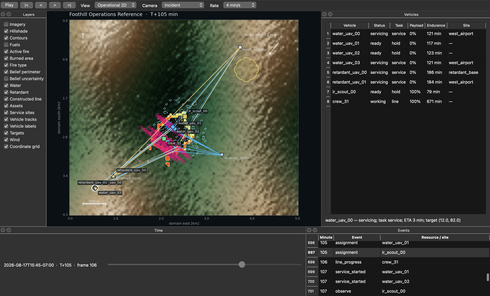
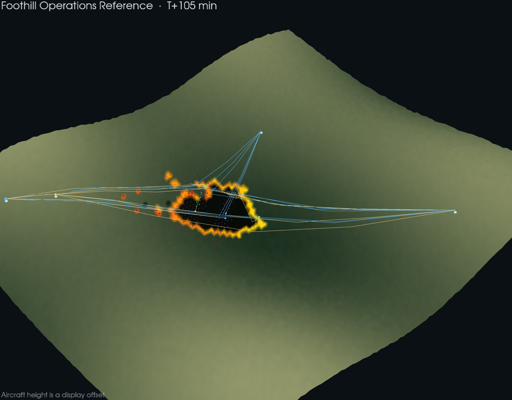

# Replay inspection and rendering

Aeolus training and simulation are headless. Visualization reads an immutable
`ReplayBundle` after an episode has run. The viewer cannot alter a policy
action, simulator state, event record, or metric. This separation keeps the
render loop out of accelerator workers and makes every published view
reproducible from the archived episode.

The native application uses Qt for controls and VTK for terrain rendering. The
operational map and deterministic export path share the same replay model and
layer definitions. No browser, tile server, or network service is involved.





## Install

Python 3.10–3.12 and an OpenGL 3.3-capable workstation are required for the
desktop application.

```bash
python3 -m venv .venv
. .venv/bin/activate
python -m pip install --upgrade pip
python -m pip install -e '.[geo,viewer,dev]'
pytest -q tests/test_replay.py tests/test_viewer.py
```

Cluster jobs do not need the `viewer` extra. Record a replay on shared storage,
then inspect it on a workstation:

```bash
aeolus-replay \
  --config configs/replay_reference.yaml \
  --policy joint_assignment \
  --out runs/replays/reference

aeolus-view \
  --replay runs/replays/reference \
  --config configs/viewer/operational.yaml
```

`joint_assignment` is an exact assignment comparator, not a learned policy.
Use `--policy mappo --checkpoint PATH` for a trained checkpoint.

## Desktop controls

| Control | Function |
|---|---|
| Play/Pause or `Space` | Advance replay time |
| `←` / `→` | Previous or next recorded frame |
| first/last buttons | Seek to episode endpoints |
| timeline | Seek to an arbitrary recorded frame |
| rate selector | Set simulated minutes advanced per wall-clock second |
| `1` / `2` | Operational 2D or terrain 3D |
| camera selector | Incident, north-up, or selected-vehicle follow |
| vehicle table | Select a vehicle and inspect task, payload, endurance, ETA, and service site |
| event table double-click | Seek to an event timestamp |
| layer checkboxes | Change the current truth, belief, treatment, logistics, and context overlays |
| map cursor | Read position, wind, temperature, and relative humidity at a cell |
| `Ctrl+E` | Export the current frame |
| `Ctrl+W` | Close the viewer |

The 2D view uses a metric local grid unless the source incident supplies a CRS
and affine transform. In a georeferenced replay, cursor coordinates are shown
in the recorded CRS. The north arrow describes raster north; it does not infer
magnetic variation.

The 3D view uses physical metres horizontally and vertically. Terrain can be
exaggerated through the viewer configuration. Resource positions are
ground-projected by the simulator; aircraft are lifted by a small display
offset so their tracks remain visible. The offset is explicitly marked in the
view and is not flight altitude.

## Layer semantics

The layer panel keeps different epistemic and operational quantities distinct:

| Layer | Recorded quantity |
|---|---|
| active fire | truth cells in the active phase, colored by logarithmic fireline intensity |
| burned area | truth cells in the burned phase |
| fire type | passive/active crown-fire boundary over the surface-fire view |
| belief perimeter | delayed/noisy incident belief, separate from hidden truth |
| belief uncertainty | cells with intermediate posterior burn probability |
| water / retardant | effective coverage in gallons per 100 ft² |
| constructed line | unengaged, holding, or breached line state |
| assets | non-zero objective-value support |
| service sites | airports, helibases, bases, dip sites, scoopable water, and temporary tanks |
| vehicle tracks | recorded ground track over the configured trailing time |
| targets | current assignment segment or point |
| wind | local wind-from direction and speed sampled at the active fire |

An operational view can show truth and belief together for post-run diagnosis.
It is not the policy observation. Policy information boundaries are defined in
[`architecture.md`](architecture.md).

## View manifests

Viewer choices are versioned independently from scenario and training choices.
The supplied manifests are:

- `configs/viewer/operational.yaml`: combined incident, fleet, logistics, and
  treatment inspection;
- `configs/viewer/fire_behavior.yaml`: terrain, truth fire behavior, and crown
  transition without suppression clutter;
- `configs/viewer/belief.yaml`: belief perimeter and intermediate posterior
  burn probability without hidden-truth or treatment overlays;
- `configs/viewer/suppression.yaml`: treatment, constructed line, targets, and
  resource history;
- `configs/viewer/logistics.yaml`: service nodes, assignments, vehicle state,
  and longer mission histories;
- `configs/viewer/imagery-template.yaml`: local georeferenced imagery.

The complete schema is:

```yaml
schema_version: 1
preset: operational

window:
  width: 1680
  height: 1050
  start_view: operational_2d       # operational_2d | terrain_3d
  show_vehicle_panel: true
  show_event_panel: true
  show_layer_panel: true

playback:
  rate: 4.0                        # simulated min / real s
  refresh_hz: 20
  loop: false
  trail_minutes: 45
  event_autoselect: true

camera:
  mode: incident                   # incident | north_up | follow
  elevation_deg: 42.0
  azimuth_deg: -132.0
  vertical_exaggeration: 1.6
  follow_resource: null
  follow_radius_cells: 28.0

layers:
  imagery: false
  hillshade: true
  contours: true
  fuels: false
  active_fire: true
  burned_area: true
  fire_type: true
  belief_perimeter: true
  belief_uncertainty: false
  water: true
  retardant: true
  constructed_line: true
  assets: true
  service_sites: true
  vehicle_tracks: true
  vehicle_labels: true
  targets: true
  wind: true
  coordinate_grid: true

imagery:
  path: null
  bands: [1, 2, 3]
  gamma: 1.0
  opacity: 0.82
  attribution: null

export:
  width: 1920
  height: 1080
  dpi: 160
  fps: 20
  codec: libx264
```

Unknown keys, invalid enums, unsupported schema versions, unsafe dimensions,
and invalid numeric ranges fail during load. The desktop **Save view
configuration** command writes the current camera and layer state to YAML.

## Local imagery

The viewer deliberately does not fetch online basemaps. A result therefore
does not change when a tile provider revises imagery, and rendering a sensitive
or disconnected dataset does not disclose its extent.

GeoTIFF is the preferred format. When both image and replay carry a CRS, the
loader reprojects the selected one-based RGB bands to the replay affine grid.
Without georeferencing, a GeoTIFF must already have the exact replay shape.
PNG, JPEG, WebP, and three-channel NPY are accepted as presentation
backgrounds and resized to the replay grid; they do not establish a spatial
reference.

```yaml
preset: imagery
layers:
  imagery: true
imagery:
  path: /archive/incident/orthophoto.tif
  bands: [1, 2, 3]
  gamma: 1.05
  opacity: 0.88
  attribution: "Agency, product, acquisition timestamp"
```

Relative paths are resolved from the viewer manifest. The loader applies a
per-band 2nd–98th percentile display stretch and gamma correction. It does not
perform atmospheric correction, pan sharpening, cloud masking, or semantic
classification. Record source, acquisition time, processing level, and usage
rights in `attribution`.

## Deterministic exports

Still images and videos are generated directly from the replay; a desktop
window is not required.

```bash
aeolus-replay \
  --config configs/replay_reference.yaml \
  --policy joint_assignment \
  --out runs/replays/reference \
  --viewer-config configs/viewer/suppression.yaml \
  --frame 105 \
  --selected-resource water_uav_00 \
  --frame-2d runs/figures/reference-2d.png \
  --frame-3d runs/figures/reference-3d.png \
  --video runs/figures/reference.mp4 \
  --view operational_2d \
  --fps 20 \
  --max-video-frames 151
```

Negative `--frame` values count from the end. Video frames are sampled evenly
when `--max-video-frames` is smaller than the replay length. H.264 export uses
the FFmpeg binary provided by `imageio-ffmpeg`.

### ParaView

For independent field inspection, export a VTK multiblock time series:

```bash
aeolus-replay \
  --config configs/replay_reference.yaml \
  --policy joint_assignment \
  --out runs/replays/reference \
  --paraview runs/paraview/reference \
  --max-video-frames 151
```

Open `aeolus-replay.pvd` in ParaView. Each timestep contains terrain plus
truth, belief, treatment, weather, resource, and service-site blocks. Time is
simulation minute. Coordinates are local metres; aircraft remain
ground-projected because altitude is absent from the simulation state.

## Replay integrity

Replay schema 2 stores:

- one-minute truth, belief, suppression, and full weather rasters;
- resource position, status, payload, endurance, ETA, task, target, current
  site, and requested service site;
- remaining finite suppressant volume at every service node;
- typed Parquet events;
- terrain/fuel/canopy/barrier/asset fields;
- scenario identity, location label, time origin, spatial reference, full
  scenario manifest, episode outcome, policy identifier, and checkpoint
  SHA-256.

Schema 1 remains readable. A schema 1 viewer falls back to scenario-wide
weather and marks fields absent from that version as unavailable. The viewer
never reconstructs a missing operational state from screen geometry.

For a reported result, archive the replay directory, viewer YAML, code
revision, container digest, and source IncidentBundle. A still or video is
illustrative evidence, not the episode record.

## Performance and failure diagnosis

- If the 3D panel reports an OpenGL error, update the workstation graphics
  driver and verify an OpenGL 3.3 context. The 2D view and headless exports
  remain usable.
- Do not run the desktop application inside a Slurm worker. Record on the
  cluster and view from shared or copied storage.
- Full raster weather makes schema 2 larger than schema 1. Zarr chunks are one
  time slice deep and compressed with bit-shuffled Zstandard so spatial fields
  remain seekable.
- Large event histories and many tracks can dominate interactive redraw.
  Reduce `trail_minutes`, disable labels, or select the fire-behavior preset.
- GeoTIFF reprojection requires the `geo` extra and complete replay
  CRS/transform metadata. Shape-only fallback is intentionally strict.

## Design references

The interface follows the common operational-replay pattern of synchronized
2D/3D geospatial views, selectable entities, temporal playback, and
time-correlated data described by the U.S. Naval Research Laboratory
[SIMDIS SDK](https://github.com/USNavalResearchLaboratory/simdissdk) and the
[TRMC SIMDIS overview](https://www.trmc.osd.mil/attachments/SIMDIS_Brochure.pdf).
Its external scientific path uses ParaView's native
[time manager, camera tracks, and export model](https://docs.paraview.org/en/v6.1.1/UsersGuide/animation.html).
The embedded terrain view uses the official
[PyVistaQt Qt integration](https://docs.pyvista.org/api/plotting/qt_plotting).
These are interaction and interoperability references; they do not imply
validation, sponsorship, or interface equivalence.
